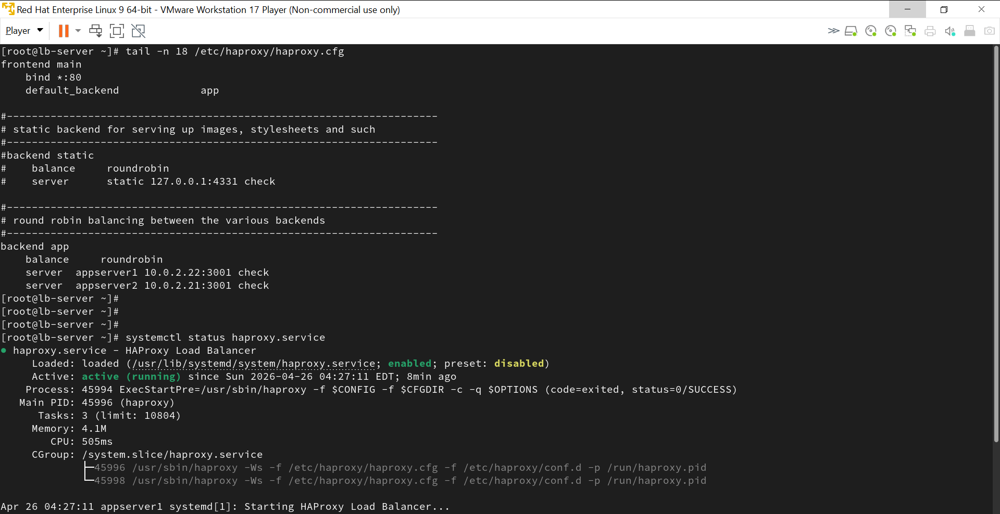
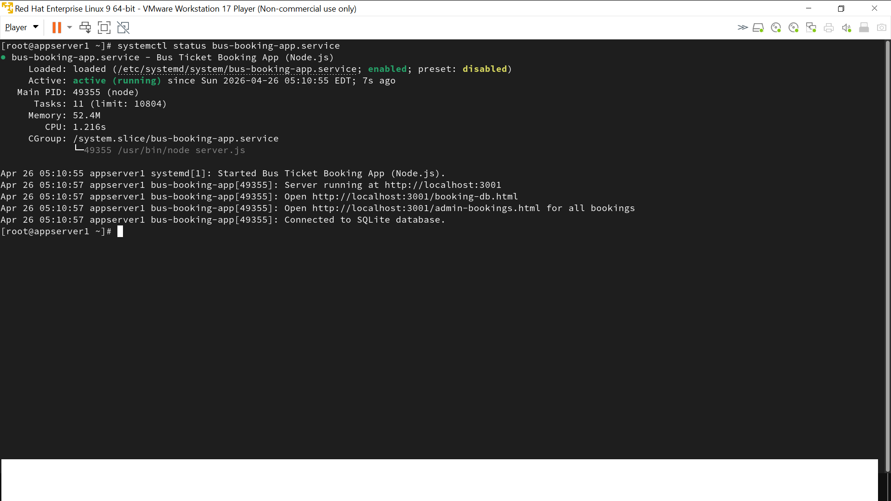
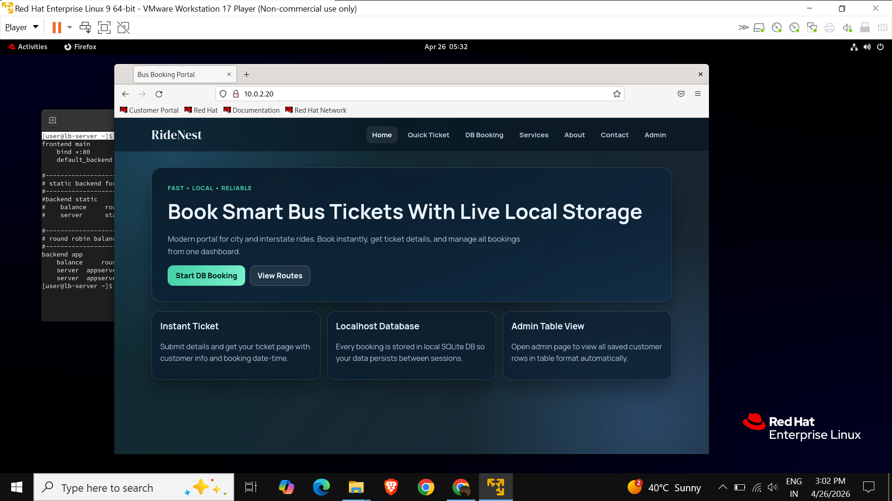

# Traffic Distribution with Web Application

> **Bus Ticket Booking System** — A full-stack web application deployed across a 4-server Linux infrastructure with HAProxy load balancing.

---
## Screenshots


### systemd Service Status


### App Running (via HAProxy)


## Team & Roles

| Member | Role |
|---|---|
| Rushikesh Chandanwar | Infrastructure — Server provisioning, HAProxy, firewall, deployment |
| Teammate 2 | Backend Developer — Node.js + SQLite server |
| Teammate 3 | Frontend Developer — HTML, CSS, JS |

---

## My Infrastructure Work ⭐

I designed, provisioned, and configured the complete 4-server Linux environment so the app could go live:

- Provisioned **4 RHEL 9 / CentOS servers** from scratch
- Configured **HAProxy** with round-robin load balancing across 2 Node.js app servers
- Applied **firewalld zone-based rules** on all 4 servers — only required ports open, everything else blocked
- Installed **Node.js, NPM, SQLite** and all app dependencies on both app servers
- Created **systemd service files** so the app auto-starts and restarts on failure
- Verified all services were running and the app was live end-to-end

---

## Architecture

```
                       [Clients]
                           |
                    HTTP (port 80)
                           |
              ┌────────────────────────┐
              │   HAProxy Load Balancer │  ← firewalld: port 80
              │      (RHEL 9 / CentOS)  │
              └────────────────────────┘
                    /             \
             Round-robin traffic distribution
                  /                 \
    ┌──────────────────┐   ┌──────────────────┐
    │   App Server 1   │   │   App Server 2   │
    │  Node.js :3001   │   │  Node.js :3001   │  ← firewalld: port 3001
    │  NPM + SQLite    │   │  NPM + SQLite    │
    └──────────────────┘   └──────────────────┘
                \                 /
                 \               /
              ┌──────────────────────┐
              │   MySQL DB Server    │  ← firewalld: port 3306
              │      (RHEL 9)        │
              └──────────────────────┘
```

---

## Setup Files

All my work is in the `/infrastructure` folder:

| File | Description |
|---|---|
| `infrastructure/haproxy/haproxy.cfg` | HAProxy config — round-robin, health checks, stats page |
| `infrastructure/firewall/firewall-setup.sh` | firewalld rules for all 3 server types |
| `infrastructure/setup/install-dependencies.sh` | Node.js, NPM, SQLite installation script |
| `infrastructure/systemd/ticket-booking.service` | systemd unit file for the Node.js app |
| `infrastructure/systemd/start-services.sh` | Script to enable and start all services |

---

## Application Features (Built by teammates)

- **Home page** — Bus route search and navigation
- **Booking page** — Passenger form with route and date selection
- **DB Booking** — Saves booking to SQLite database via Express API
- **Ticket view** — Displays booking details from DB by ticket ID
- **Admin panel** — Shows all bookings in a table

---

## Tech Stack

| Layer | Technology |
|---|---|
| Load Balancer | HAProxy |
| OS | RHEL9, CentOS |
| Network Security | firewalld |
| Service Management | systemctl / systemd |
| Backend | Node.js, Express |
| Database | SQLite |
| Frontend | HTML, CSS, JavaScript |

---

## Running the App Locally (Dev)

```bash
cd app
npm install
npm start
# Open http://localhost:3001
```

---

## Final Year Project - 2025-2026

Team Project (3 members)
